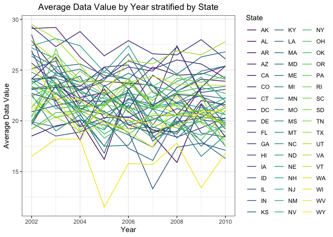
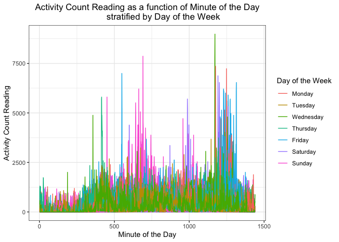

p8105\_hw3\_bpg2118
================
Benjamin Goebel
10/20/2021

#### **Problem 1**

First, let’s read in the instacart data.

``` r
data("instacart")
```

This data set is 1,384,617 rows and 15 columns. Each observation in this
data set represents a product in each order. Some key variables include
order\_id, product\_id, department\_id and aisle\_id; these are the
respective IDs for the order, product, department and aisle. There are
131,209 orders, 39,123 products, 21 departments and 134 aisles in the
instacart data set.

Other key variables include product\_name, the product name of the
ordered item, and order\_dow, an encoded variable indicating the day of
the week of the order.

Here is some info on the different products that were ordered in the
instacart data set:

-   Bulgarian Yogurt for order\_id 1 was ordered. This item is located
    in the yogurt aisle in the dairy eggs department.
-   Shelled Pistachios for order\_id 38 was ordered. This item is
    located in the nuts seeds dried fruit aisle in the snacks
    department.
-   Queso Fresco was ordered in 87 different orders.

Additionally, we can organize the data set from the aisle with the most
items ordered to the aisle with the least items ordered. Let’s focus on
the aisles with the most items ordered.

``` r
# Grouping by aisle and summarizing the total number of items ordered for the
# aisle arranged from most items ordered to least items ordered
(most_items_ordered_aisles <- instacart %>%
                                group_by(aisle_id) %>%
                                summarize(items_ordered = n()) %>%
                                arrange(desc(items_ordered)))
```

    ## # A tibble: 134 × 2
    ##    aisle_id items_ordered
    ##       <int>         <int>
    ##  1       83        150609
    ##  2       24        150473
    ##  3      123         78493
    ##  4      120         55240
    ##  5       21         41699
    ##  6      115         36617
    ##  7       84         32644
    ##  8      107         31269
    ##  9       91         26240
    ## 10      112         23635
    ## # … with 124 more rows

From this table, we see that aisle number 83 is the aisle with the most
ordered items, followed by aisles 24 and 123.

Next, we can create a plot showing the number of items ordered in each
aisle. We will limit this to aisles with more than 10,000 items ordered.

``` r
# Bar graph showing the total number of items ordered in each aisle.
# Bars ordered largest to smallest from left to right.
# X-tick labels are rotated 90 degrees to provide space for all of the aisle #s
  most_items_ordered_aisles %>%
    filter(items_ordered > 10000) %>%
    ggplot(aes(x = reorder(aisle_id, -items_ordered), y = items_ordered)) +
      geom_bar(stat = "identity", width = 0.5) +
      labs(
      title = "Number of Items Ordered in each Aisle
               for Aisles with Items Ordered over 10,000",
      x = "Aisle Number",
      y = "Total Items Ordered"
    ) +
    theme_bw() +
    theme(axis.text.x = element_text(angle = 90, vjust = 0.5, hjust = 1),
          plot.title = element_text(hjust = 0.5)) +
    scale_y_continuous(labels = scales::comma)
```

<!-- -->

Next, we can make a table of the three most popular items in each aisle.

``` r
# Get order frequencies for each unique group (aisle number, product name)
# Filter for the three largest order frequencies for each aisle
instacart %>%
  group_by(aisle, product_name) %>%
  summarize(order_freq = n()) %>%
  slice_max(order_by = order_freq, n = 3) %>%
  knitr::kable()
```

| aisle                         | product\_name                                                                                      | order\_freq |
|:------------------------------|:---------------------------------------------------------------------------------------------------|------------:|
| air fresheners candles        | Air Effects Linen & Sky Scent Air Freshener Spray                                                  |          36 |
| air fresheners candles        | After The Rain Gel Air Freshener                                                                   |          32 |
| air fresheners candles        | Air Effects Linen & Sky Air Refresher                                                              |          30 |
| asian foods                   | Organic Sea Salt Roasted Seaweed Snacks                                                            |         345 |
| asian foods                   | Sriracha Chili Sauce                                                                               |         188 |
| asian foods                   | Coconut Milk                                                                                       |         185 |
| baby accessories              | Free & Clear Unscented Baby Wipes                                                                  |         225 |
| baby accessories              | Totz Toothbrush Extra Soft 18+ Months                                                              |          23 |
| baby accessories              | Swaddlers Size 4 Giant Pack Diapers                                                                |          10 |
| baby bath body care           | Calming Shampoo & Bodywash                                                                         |          18 |
| baby bath body care           | Unscented Pure Castile Soap                                                                        |          17 |
| baby bath body care           | Everyday Shea Lavender Bubble Bath                                                                 |          16 |
| baby food formula             | Baby Food Stage 2 Blueberry Pear & Purple Carrot                                                   |         310 |
| baby food formula             | Spinach Peas & Pear Stage 2 Baby Food                                                              |         268 |
| baby food formula             | Gluten Free SpongeBob Spinach Littles                                                              |         259 |
| bakery desserts               | Muffins, Mini, Flax, Chocolate Brownie                                                             |          91 |
| bakery desserts               | Cookie Tray                                                                                        |          72 |
| bakery desserts               | Vegan Chocolate Chip Mini Muffins                                                                  |          68 |
| baking ingredients            | Light Brown Sugar                                                                                  |         499 |
| baking ingredients            | Pure Baking Soda                                                                                   |         387 |
| baking ingredients            | Cane Sugar                                                                                         |         336 |
| baking supplies decor         | 100% Recycled Aluminum Foil                                                                        |         127 |
| baking supplies decor         | Heavy Duty Aluminum Foil                                                                           |          74 |
| baking supplies decor         | Non-Stick Parchment Paper                                                                          |          74 |
| beauty                        | Organic Cotton Balls                                                                               |          41 |
| beauty                        | Cotton Rounds                                                                                      |          32 |
| beauty                        | Jumbo Cotton Balls                                                                                 |          23 |
| beers coolers                 | Beer                                                                                               |         224 |
| beers coolers                 | India Pale Ale                                                                                     |         157 |
| beers coolers                 | Belgian White Wheat Ale                                                                            |          62 |
| body lotions soap             | Deep Moisture Body Wash                                                                            |          88 |
| body lotions soap             | White Beauty Bar                                                                                   |          83 |
| body lotions soap             | Sensitive Skin Moisturizing Cream Soap Bars                                                        |          76 |
| bread                         | 100% Whole Wheat Bread                                                                             |        2298 |
| bread                         | Organic Bread with 21 Whole Grains                                                                 |         938 |
| bread                         | Sourdough Bread                                                                                    |         738 |
| breakfast bakery              | Original Nooks & Crannies English Muffins                                                          |         669 |
| breakfast bakery              | Plain Bagels                                                                                       |         443 |
| breakfast bakery              | Organic Whole Grain Wheat English Muffins                                                          |         417 |
| breakfast bars pastries       | Cinnamon Brown Sugar Breakfast Biscuits                                                            |         163 |
| breakfast bars pastries       | Oats & Chocolate Chewy Bars                                                                        |         116 |
| breakfast bars pastries       | Nutri-Grain Soft Baked Strawberry Cereal Breakfast Bars                                            |         106 |
| bulk dried fruits vegetables  | Dried Mango                                                                                        |         446 |
| bulk dried fruits vegetables  | Organic Black Mission Figs                                                                         |         125 |
| bulk dried fruits vegetables  | Apricots                                                                                           |          87 |
| bulk grains rice dried goods  | Organic Rolled Oats                                                                                |         259 |
| bulk grains rice dried goods  | Rolled Oats                                                                                        |          54 |
| bulk grains rice dried goods  | Organic Quick Rolled Oats                                                                          |          48 |
| buns rolls                    | Authentic French Brioche Hamburger Buns                                                            |         380 |
| buns rolls                    | Hot Dog Buns                                                                                       |         343 |
| buns rolls                    | Sweet Rolls                                                                                        |         302 |
| butter                        | Pure Irish Butter                                                                                  |        1476 |
| butter                        | Unsalted Butter                                                                                    |        1435 |
| butter                        | Salted Butter                                                                                      |         808 |
| candy chocolate               | Almonds & Sea Salt in Dark Chocolate                                                               |         461 |
| candy chocolate               | Organic Dark Chocolate Peanut Butter Cups                                                          |         408 |
| candy chocolate               | Almonds                                                                                            |         265 |
| canned fruit applesauce       | Organic AppleApple                                                                                 |         651 |
| canned fruit applesauce       | Apple Sauce                                                                                        |         239 |
| canned fruit applesauce       | Gogo Squeez Organic Apple Strawberry Applesauce on the Go                                          |         172 |
| canned jarred vegetables      | Organic Diced Tomatoes                                                                             |         837 |
| canned jarred vegetables      | Organic Tomato Paste                                                                               |         707 |
| canned jarred vegetables      | Diced Tomatoes                                                                                     |         628 |
| canned meals beans            | Organic Black Beans                                                                                |        1576 |
| canned meals beans            | No Salt Added Black Beans                                                                          |        1250 |
| canned meals beans            | Organic Garbanzo Beans                                                                             |        1141 |
| canned meat seafood           | Solid White Albacore Tuna In Water                                                                 |         193 |
| canned meat seafood           | Wild Albacore Tuna No Salt Added                                                                   |         170 |
| canned meat seafood           | Chunk Light Tuna In Water                                                                          |         162 |
| cat food care                 | Double Duty Advanced Odor Control Clumping Cat Litter                                              |          84 |
| cat food care                 | 24/7 Performance Cat Litter                                                                        |          76 |
| cat food care                 | Instant Action Cat Litter                                                                          |          73 |
| cereal                        | Honey Nut Cheerios                                                                                 |        1218 |
| cereal                        | Raisin Bran Cereal                                                                                 |         600 |
| cereal                        | Cereal                                                                                             |         590 |
| chips pretzels                | Lightly Salted Baked Snap Pea Crisps                                                               |         991 |
| chips pretzels                | Pretzel Crisps Original Deli Style Pretzel Crackers                                                |         753 |
| chips pretzels                | Sea Salt Pita Chips                                                                                |         707 |
| cleaning products             | Lemongrass Citrus Scent Disinfecting Wipes                                                         |         144 |
| cleaning products             | Disinfecting Wipes, Lemon                                                                          |         141 |
| cleaning products             | Heavy Duty Scrub Sponges                                                                           |         134 |
| cocoa drink mixes             | Cocoa Powder                                                                                       |          88 |
| cocoa drink mixes             | Milk Chocolate Hot Cocoa Mix                                                                       |          38 |
| cocoa drink mixes             | Pink Lemonade Drink Mix                                                                            |          31 |
| coffee                        | Cold Brew Coffee                                                                                   |         272 |
| coffee                        | Major Dickason’s Blend Ground Coffee Dark Roast                                                    |         256 |
| coffee                        | Cold-Brew Black Coffee                                                                             |         213 |
| cold flu allergy              | Oscillo Oscillococcinum Quick-Dissolving Pellets                                                   |          55 |
| cold flu allergy              | The Original Natural Herb Drops Cough Suppressant                                                  |          34 |
| cold flu allergy              | Coldcalm Homeopathic Tablets                                                                       |          32 |
| condiments                    | Tomato Ketchup                                                                                     |         625 |
| condiments                    | Organic Ketchup                                                                                    |         610 |
| condiments                    | Original Hot Sauce                                                                                 |         495 |
| cookies cakes                 | Chocolate Chip Cookies                                                                             |         614 |
| cookies cakes                 | Gluten Free Chocolate Chip Cookies                                                                 |         380 |
| cookies cakes                 | Oreo Chocolate Sandwich Cookies                                                                    |         232 |
| crackers                      | Hint Of Sea Salt Almond Nut Thins                                                                  |         494 |
| crackers                      | Crackers Cheddar Bunnies Snack Packs                                                               |         437 |
| crackers                      | Cheddar Bunnies Snack Crackers                                                                     |         397 |
| cream                         | Organic Half & Half                                                                                |        2646 |
| cream                         | Half & Half                                                                                        |        2424 |
| cream                         | Heavy Whipping Cream                                                                               |         878 |
| deodorants                    | Men Dry Protection Cool Rush Antiperspirant & Deodorant                                            |          33 |
| deodorants                    | Shower Fresh Invisible Solid Women’s Antiperspirant & Deodorant                                    |          32 |
| deodorants                    | Lavender Long Lasting Deodorant                                                                    |          25 |
| diapers wipes                 | Baby Wipes                                                                                         |          81 |
| diapers wipes                 | Honest Face, Hand, & Baby Wipes                                                                    |          78 |
| diapers wipes                 | Baby Wipes Sensitive                                                                               |          65 |
| digestion                     | Organic Lowfat Mango Kefir                                                                         |          98 |
| digestion                     | Straightshot Probiotic Oat Drink                                                                   |          51 |
| digestion                     | Probiotic Green Coconut Water                                                                      |          31 |
| digestion                     | Raw Probiotics Women probiotic 85 Billion 32 Strains capsules                                      |          31 |
| digestion                     | Ultimate Flora Critical Care 50 Billion                                                            |          31 |
| dish detergents               | Natural Free & Clear Dish Liquid                                                                   |         277 |
| dish detergents               | Lemon Verbena Dish Soap                                                                            |         250 |
| dish detergents               | Dishwasher Gel Free & Clear                                                                        |         147 |
| dog food care                 | Snack Sticks Chicken & Rice Recipe Dog Treats                                                      |          30 |
| dog food care                 | Organix Chicken & Brown Rice Recipe                                                                |          28 |
| dog food care                 | Small Dog Biscuits                                                                                 |          26 |
| doughs gelatins bake mixes    | Cinnamon Rolls with Icing                                                                          |         459 |
| doughs gelatins bake mixes    | Flaky Biscuits                                                                                     |         343 |
| doughs gelatins bake mixes    | Crescent Rolls                                                                                     |         329 |
| dry pasta                     | Spaghetti                                                                                          |         640 |
| dry pasta                     | Spaghetti Pasta                                                                                    |         430 |
| dry pasta                     | Penne Rigate                                                                                       |         420 |
| eggs                          | Large Alfresco Eggs                                                                                |        1898 |
| eggs                          | Organic Grade A Free Range Large Brown Eggs                                                        |        1767 |
| eggs                          | Organic Large Brown Grade AA Cage Free Eggs                                                        |        1137 |
| energy granola bars           | Kids Organic Chocolate Chip ZBars                                                                  |         451 |
| energy granola bars           | Gluten Free Dark Chocolate Chunk Chewy with a Crunch Granola Bars                                  |         361 |
| energy granola bars           | Crunchy Oats ’n Honey Granola Bars                                                                 |         359 |
| energy sports drinks          | Fruit Punch Sports Drink                                                                           |         275 |
| energy sports drinks          | Vitamin Water Zero Squeezed Lemonade                                                               |         257 |
| energy sports drinks          | Energy Drink                                                                                       |         234 |
| eye ear care                  | Cotton Swabs                                                                                       |         258 |
| eye ear care                  | Opti-Free Replenish Multi-Purpose Disinfecting Solution                                            |          17 |
| eye ear care                  | Triple Action Cleaning and Disinfecting Solution Twin Pack                                         |          16 |
| facial care                   | Makeup Remover Cleansing Towelettes                                                                |         100 |
| facial care                   | Makeup Remover Cleansing Towelettes Refill                                                         |          48 |
| facial care                   | Sensitive Skin Experts Cleansing Facial Wipes                                                      |          47 |
| feminine care                 | Pearl Regular Absorbency Unscented Tampons                                                         |          26 |
| feminine care                 | Organic Regular Cotton Tampons No Applicator                                                       |          25 |
| feminine care                 | Curved Panty Liners                                                                                |          22 |
| first aid                     | Hydrogen Peroxide                                                                                  |          81 |
| first aid                     | Neosporin 24 Hour Infection Protection First Aid Antibiotic Ointment                               |          18 |
| first aid                     | Hydrogen Peroxide 3%                                                                               |          13 |
| food storage                  | Aluminum Foil                                                                                      |         407 |
| food storage                  | Variety Pack                                                                                       |         242 |
| food storage                  | Sandwich Bags                                                                                      |         188 |
| fresh dips tapenades          | Original Hummus                                                                                    |        2858 |
| fresh dips tapenades          | Roasted Red Pepper Hummus                                                                          |         791 |
| fresh dips tapenades          | Classic Hummus                                                                                     |         694 |
| fresh fruits                  | Banana                                                                                             |       18726 |
| fresh fruits                  | Bag of Organic Bananas                                                                             |       15480 |
| fresh fruits                  | Organic Strawberries                                                                               |       10894 |
| fresh herbs                   | Organic Cilantro                                                                                   |        3526 |
| fresh herbs                   | Organic Italian Parsley Bunch                                                                      |        2400 |
| fresh herbs                   | Bunched Cilantro                                                                                   |        1920 |
| fresh pasta                   | Freshly Made. Filled with Creamy Ricotta, Aged Parmesan and Romano Cheeses Three Cheese Tortellini |         161 |
| fresh pasta                   | Ravioli, Spinach & Cheese                                                                          |          97 |
| fresh pasta                   | Cheese Ravioli                                                                                     |          87 |
| fresh vegetables              | Organic Cucumber                                                                                   |        4613 |
| fresh vegetables              | Organic Zucchini                                                                                   |        4589 |
| fresh vegetables              | Organic Yellow Onion                                                                               |        4290 |
| frozen appetizers sides       | Naturals Chicken Nuggets                                                                           |         453 |
| frozen appetizers sides       | Cheese Pizza Snacks                                                                                |         368 |
| frozen appetizers sides       | Chicken Breast Tenders Breaded                                                                     |         337 |
| frozen breads doughs          | Gluten Free Whole Grain Bread                                                                      |         492 |
| frozen breads doughs          | Pizza Dough                                                                                        |         105 |
| frozen breads doughs          | Sprouted Grain Bread Cinnamon Raisin                                                               |          59 |
| frozen breakfast              | Chicken & Maple Breakfast Sausage                                                                  |         570 |
| frozen breakfast              | Eggo Homestyle Waffles                                                                             |         470 |
| frozen breakfast              | Organic Multigrain Waffles                                                                         |         421 |
| frozen dessert                | Dark Chocolate Covered Banana                                                                      |         166 |
| frozen dessert                | Original Whipped Topping                                                                           |         123 |
| frozen dessert                | Pastry Kitchens Classic Puff Pastry                                                                |          51 |
| frozen juice                  | Orange Juice with Calcium                                                                          |          52 |
| frozen juice                  | Pitaya Dragonfruit Raw, Organic Smoothie Packs                                                     |          19 |
| frozen juice                  | Smoothies, Strawberries Wild                                                                       |          19 |
| frozen meals                  | Macaroni & Cheese                                                                                  |         712 |
| frozen meals                  | Organic Brown Rice                                                                                 |         572 |
| frozen meals                  | Pesto Tortellini Bowls                                                                             |         394 |
| frozen meat seafood           | Organic Chicken Strips                                                                             |         451 |
| frozen meat seafood           | Raw Shrimp                                                                                         |         224 |
| frozen meat seafood           | Natural Chicken & Maple Breakfast Sausage Patty                                                    |         203 |
| frozen pizza                  | Organic Cheese Frozen Pizza                                                                        |         538 |
| frozen pizza                  | Thin Crust Pepperoni Pizza                                                                         |         473 |
| frozen pizza                  | Margherita Pizza                                                                                   |         336 |
| frozen produce                | Blueberries                                                                                        |        2323 |
| frozen produce                | Organic Broccoli Florets                                                                           |        1361 |
| frozen produce                | Organic Whole Strawberries                                                                         |        1213 |
| frozen vegan vegetarian       | Seven Grain Crispy Tenders                                                                         |         341 |
| frozen vegan vegetarian       | California Veggie Burgers - 4 CT                                                                   |         208 |
| frozen vegan vegetarian       | Chik’n Nuggets                                                                                     |         196 |
| fruit vegetable snacks        | Original Veggie Straws                                                                             |         684 |
| fruit vegetable snacks        | Mixed Fruit Fruit Snacks                                                                           |         489 |
| fruit vegetable snacks        | Organic Bunny Fruit Snacks Berry Patch                                                             |         475 |
| fruit vegetable snacks        | Organic Summer Strawberry Bunny Fruit Snacks                                                       |         475 |
| grains rice dried goods       | Original Rice Pilaf Mix                                                                            |         397 |
| grains rice dried goods       | Organic Long Grain White Rice                                                                      |         359 |
| grains rice dried goods       | Organic Short Grain Brown Rice                                                                     |         314 |
| granola                       | Vanilla Blueberry Clusters With Flax Seeds Granola                                                 |         239 |
| granola                       | Flax Plus Organic Pumpkin Flax Granola                                                             |         237 |
| granola                       | Ancient Grain Original Granola                                                                     |         218 |
| hair care                     | Hair Shampoos                                                                                      |          27 |
| hair care                     | Classic Clean Anti-Dandruff Shampoo                                                                |          24 |
| hair care                     | Shampoo, Body Wash, Bubble Bath Coconut+Lemon                                                      |          24 |
| honeys syrups nectars         | Organic Mountain Forest Amber Honey                                                                |         267 |
| honeys syrups nectars         | Original Syrup                                                                                     |         224 |
| honeys syrups nectars         | Organic Light Agave Nectar                                                                         |         147 |
| hot cereal pancake mixes      | Organic Old Fashioned Rolled Oats                                                                  |         747 |
| hot cereal pancake mixes      | Organic Quick Oats                                                                                 |         357 |
| hot cereal pancake mixes      | Old Fashioned Rolled Oats                                                                          |         232 |
| hot dogs bacon sausage        | Uncured Hickory Smoked Sunday Bacon                                                                |         835 |
| hot dogs bacon sausage        | Organic Turkey Bacon                                                                               |         603 |
| hot dogs bacon sausage        | Natural Chicken & Sage Breakfast Sausage                                                           |         554 |
| ice cream ice                 | Chocolate Ice Cream                                                                                |         635 |
| ice cream ice                 | Vanilla Ice Cream                                                                                  |         443 |
| ice cream ice                 | Chocolate Chip Cookie Dough Ice Cream                                                              |         418 |
| ice cream toppings            | Genuine Chocolate Flavor Syrup                                                                     |         104 |
| ice cream toppings            | Organic Chocolate Flavored Syrup                                                                   |          46 |
| ice cream toppings            | Organic Ice Cream Cones                                                                            |          35 |
| indian foods                  | Tikka Masala Mild Indian Simmer Sauce                                                              |          66 |
| indian foods                  | Madras Lentils Indian Cuisine                                                                      |          54 |
| indian foods                  | Tikka Masala Simmer Sauce                                                                          |          53 |
| instant foods                 | Macaroni Shells & White Cheddar Cheese                                                             |         448 |
| instant foods                 | Organic Macaroni Shells & Real Aged Cheddar                                                        |         409 |
| instant foods                 | Shells & Real Aged Cheddar Macaroni & Cheese                                                       |         372 |
| juice nectars                 | Pure Coconut Water                                                                                 |         729 |
| juice nectars                 | Organic Apple Juice                                                                                |         462 |
| juice nectars                 | Natural Premium Coconut Water                                                                      |         452 |
| kitchen supplies              | Wax Paper                                                                                          |          42 |
| kitchen supplies              | Primordial Himalayan Sea Salt                                                                      |          37 |
| kitchen supplies              | Pitcher Replacement Filters                                                                        |          26 |
| kosher foods                  | Lightly Breaded Fish Sticks                                                                        |          64 |
| kosher foods                  | Gluten Free Matzo-Style Squares                                                                    |          36 |
| kosher foods                  | Bamba Peanut Snack                                                                                 |          31 |
| kosher foods                  | Egg Matzos                                                                                         |          31 |
| latino foods                  | Taco Seasoning                                                                                     |         405 |
| latino foods                  | New Mexico Taco Skillet Sauce For Chicken                                                          |         224 |
| latino foods                  | Organic Spicy Taco Seasoning                                                                       |         172 |
| laundry                       | Free & Clear Natural Laundry Detergent For Sensitive Skin                                          |         177 |
| laundry                       | Natural Liquid Laundry Detergent - Blue Eucalyptus and Lavender                                    |         152 |
| laundry                       | April Fresh Liquid Fabric Softener                                                                 |         128 |
| lunch meat                    | Uncured Genoa Salami                                                                               |        1788 |
| lunch meat                    | Organic Roasted Turkey Breast                                                                      |        1123 |
| lunch meat                    | Roasted Turkey Breast                                                                              |         928 |
| marinades meat preparation    | Panko Bread Crumbs                                                                                 |         364 |
| marinades meat preparation    | Original Barbecue Sauce                                                                            |         149 |
| marinades meat preparation    | Veri Veri Teriyaki Marinade & Sauce                                                                |         133 |
| meat counter                  | 85% Lean Ground Beef                                                                               |         642 |
| meat counter                  | 90% Lean Ground Beef                                                                               |         292 |
| meat counter                  | 93% Ground Beef                                                                                    |         255 |
| milk                          | Organic Whole Milk                                                                                 |        4908 |
| milk                          | 2% Reduced Fat Milk                                                                                |        1540 |
| milk                          | Organic Reduced Fat 2% Milk                                                                        |        1535 |
| mint gum                      | Wint-O-Green                                                                                       |          70 |
| mint gum                      | Spearmint Sugar-Free Gum                                                                           |          57 |
| mint gum                      | Wrigley’s Orbit Wintermint Sugar Free Gum- 3 PK                                                    |          57 |
| missing                       | Organic Riced Cauliflower                                                                          |         823 |
| missing                       | Peanut Butter Ice Cream Cup                                                                        |         261 |
| missing                       | Organic Celery Bunch                                                                               |         200 |
| more household                | Tulips 10 Stem                                                                                     |          92 |
| more household                | Snack Bags                                                                                         |          68 |
| more household                | Coppertop AA Alkaline Batteries                                                                    |          46 |
| muscles joints pain relief    | Premium Epsom Salt                                                                                 |         149 |
| muscles joints pain relief    | Epsom Salt                                                                                         |         115 |
| muscles joints pain relief    | Ibuprofen Liquid Gels                                                                              |          40 |
| nuts seeds dried fruit        | Organic Thompson Seedless Raisins                                                                  |         513 |
| nuts seeds dried fruit        | Organic Whole Cashews                                                                              |         476 |
| nuts seeds dried fruit        | Whole Almonds                                                                                      |         448 |
| oils vinegars                 | Extra Virgin Olive Oil                                                                             |        2068 |
| oils vinegars                 | Organic Extra Virgin Olive Oil                                                                     |         620 |
| oils vinegars                 | Italian Extra Virgin Olive Oil                                                                     |         579 |
| oral hygiene                  | Fluoride-Free Antiplaque & Whitening Peppermint Toothpaste                                         |         159 |
| oral hygiene                  | Natural Anticavity Silly Strawberry Fluoride Toothpaste for Children                               |          97 |
| oral hygiene                  | Simply White Natural Clean Mint Fluoride Toothpaste                                                |          83 |
| other                         | Roasted Almond Butter                                                                              |         174 |
| other                         | Light CocoWhip! Coconut Whipped Topping                                                            |          86 |
| other                         | Roasted Unsalted Almonds                                                                           |          62 |
| other creams cheeses          | Whipped Cream Cheese                                                                               |        1078 |
| other creams cheeses          | Organic Sour Cream                                                                                 |        1047 |
| other creams cheeses          | Sour Cream                                                                                         |        1022 |
| packaged cheese               | Organic Whole String Cheese                                                                        |        1993 |
| packaged cheese               | Grated Parmesan                                                                                    |        1694 |
| packaged cheese               | Feta Cheese Crumbles                                                                               |        1449 |
| packaged meat                 | Organic Chicken Thighs                                                                             |         287 |
| packaged meat                 | Ground Buffalo                                                                                     |         231 |
| packaged meat                 | Organic 90% Ground Beef                                                                            |         137 |
| packaged poultry              | Boneless Skinless Chicken Breasts                                                                  |        2088 |
| packaged poultry              | Grilled Chicken Breast Strips                                                                      |         364 |
| packaged poultry              | Lean Ground Turky                                                                                  |         350 |
| packaged produce              | Raspberries                                                                                        |        3279 |
| packaged produce              | Hass Avocados                                                                                      |        2276 |
| packaged produce              | Clementines                                                                                        |        1351 |
| packaged seafood              | Smoked Salmon                                                                                      |         147 |
| packaged seafood              | Wild Sockeye Salmon                                                                                |         138 |
| packaged seafood              | Traditional Scottish Style Smoked Salmon                                                           |          94 |
| packaged vegetables fruits    | Organic Baby Spinach                                                                               |        9784 |
| packaged vegetables fruits    | Organic Raspberries                                                                                |        5546 |
| packaged vegetables fruits    | Organic Blueberries                                                                                |        4966 |
| paper goods                   | 100% Recycled Paper Towels                                                                         |        1183 |
| paper goods                   | Sustainably Soft Bath Tissue                                                                       |         821 |
| paper goods                   | White Giant Paper Towel Rolls                                                                      |         379 |
| pasta sauce                   | Organic Tomato Basil Pasta Sauce                                                                   |         772 |
| pasta sauce                   | Marinara Sauce                                                                                     |         754 |
| pasta sauce                   | Basil Pesto                                                                                        |         699 |
| pickled goods olives          | Sliced Black Olives                                                                                |         409 |
| pickled goods olives          | Chopped Organic Garlic                                                                             |         193 |
| pickled goods olives          | Organic Kosher Dill Pickles                                                                        |         176 |
| plates bowls cups flatware    | 9 Inch Plates                                                                                      |         119 |
| plates bowls cups flatware    | Red Plastic Cups                                                                                   |         106 |
| plates bowls cups flatware    | 8.5" Microwavable Cut Resistant Plates                                                             |          92 |
| popcorn jerky                 | 100 Calorie Per Bag Popcorn                                                                        |         552 |
| popcorn jerky                 | Baked Aged White Cheddar Rice and Corn Puffs                                                       |         546 |
| popcorn jerky                 | Boomchickapop Sea Salt Popcorn                                                                     |         497 |
| poultry counter               | Ground Turkey Breast                                                                               |         958 |
| poultry counter               | Boneless Skinless Chicken Breast                                                                   |         943 |
| poultry counter               | Air Chilled Organic Boneless Skinless Chicken Breasts                                              |         646 |
| prepared meals                | Original Rotisserie Chicken                                                                        |         332 |
| prepared meals                | Grilled Chicken Breast                                                                             |         236 |
| prepared meals                | Avocado Roll                                                                                       |         182 |
| prepared soups salads         | Tuna Salad                                                                                         |         208 |
| prepared soups salads         | Classic Chicken Salad                                                                              |         200 |
| prepared soups salads         | Chicken Noodle Soup                                                                                |         165 |
| preserved dips spreads        | Organic Medium Salsa                                                                               |         723 |
| preserved dips spreads        | Mild Salsa                                                                                         |         521 |
| preserved dips spreads        | Cucumber & Garlic Tzatziki                                                                         |         386 |
| protein meal replacements     | Vanilla Whey Protein Powder                                                                        |          97 |
| protein meal replacements     | Natural Chocolate Flavor Whey Protein Powder                                                       |          54 |
| protein meal replacements     | Vanilla Almond Builder’s Protein Bar                                                               |          49 |
| red wines                     | Cabernet Sauvignon                                                                                 |         237 |
| red wines                     | Pinot Noir                                                                                         |         139 |
| red wines                     | Malbec                                                                                             |          91 |
| refrigerated                  | 100% Raw Coconut Water                                                                             |        1298 |
| refrigerated                  | Original Orange Juice                                                                              |        1054 |
| refrigerated                  | Organic Raw Kombucha Gingerade                                                                     |         855 |
| refrigerated pudding desserts | Organic Chocolate Almondmilk Pudding                                                               |         144 |
| refrigerated pudding desserts | Original Recipe Rice Pudding                                                                       |         123 |
| refrigerated pudding desserts | Strawberry Gelatin                                                                                 |         121 |
| salad dressing toppings       | Ranch Dressing                                                                                     |         362 |
| salad dressing toppings       | Poppy Seed Dressing                                                                                |         101 |
| salad dressing toppings       | Real French Vinaigrette Dressing                                                                   |          96 |
| seafood counter               | Tilapia Filet                                                                                      |         543 |
| seafood counter               | Coho Salmon                                                                                        |         113 |
| seafood counter               | Fresh Tilapia Fillet                                                                               |          68 |
| shave needs                   | Fusion ProGlide Power Men’s Razor Blade Refills                                                    |          30 |
| shave needs                   | Shaving Cream, Soothing Aloe                                                                       |          21 |
| shave needs                   | SkinTherapy Moisturizing Shave Gel                                                                 |          21 |
| skin care                     | Sensitive Facial Cleansing Towelettes                                                              |          40 |
| skin care                     | Alcohol-Free Witch Hazel Rose Petal Toner                                                          |          26 |
| skin care                     | Lavender Hand Sanitizer                                                                            |          19 |
| soap                          | Lavender Hand Soap                                                                                 |         258 |
| soap                          | Lemon Verbena Hand Soap                                                                            |         191 |
| soap                          | Clean Day Basil Hand Soap                                                                          |         113 |
| soft drinks                   | Soda                                                                                               |        1507 |
| soft drinks                   | Fridge Pack Cola                                                                                   |         645 |
| soft drinks                   | Ginger Ale                                                                                         |         634 |
| soup broth bouillon           | Organic Low Sodium Chicken Broth                                                                   |         536 |
| soup broth bouillon           | Organic Free Range Chicken Broth                                                                   |         527 |
| soup broth bouillon           | Organic Chicken Stock                                                                              |         508 |
| soy lactosefree               | Organic Unsweetened Almond Milk                                                                    |        2176 |
| soy lactosefree               | Unsweetened Almondmilk                                                                             |        2169 |
| soy lactosefree               | Unsweetened Original Almond Breeze Almond Milk                                                     |        1465 |
| specialty cheeses             | Fresh Mozzarella Ball                                                                              |         450 |
| specialty cheeses             | Dubliner Wedge Pre Cut Cheese                                                                      |         253 |
| specialty cheeses             | Fresh Mozzarella Snacking Cheese                                                                   |         192 |
| specialty wines champagnes    | Prosecco Sparkling Wine                                                                            |          80 |
| specialty wines champagnes    | Prosecco                                                                                           |          44 |
| specialty wines champagnes    | Brut                                                                                               |          37 |
| spices seasonings             | Garlic Powder                                                                                      |         270 |
| spices seasonings             | Oregano                                                                                            |         214 |
| spices seasonings             | Original Taco Seasoning Mix                                                                        |         200 |
| spirits                       | Vodka                                                                                              |         191 |
| spirits                       | Handmade Vodka                                                                                     |          72 |
| spirits                       | 80 Vodka Holiday Edition                                                                           |          43 |
| spreads                       | Creamy Peanut Butter                                                                               |         991 |
| spreads                       | Creamy Almond Butter                                                                               |         850 |
| spreads                       | Organic Creamy Peanut Butter                                                                       |         760 |
| tea                           | Pink Lady Apple Kombucha                                                                           |         233 |
| tea                           | Premium Unsweetened Iced Tea                                                                       |         216 |
| tea                           | Zen Tea                                                                                            |         173 |
| tofu meat alternatives        | Organic Extra Firm Tofu                                                                            |        1186 |
| tofu meat alternatives        | Firm Tofu                                                                                          |         391 |
| tofu meat alternatives        | Organic SprouTofu Extra Firm Tofu                                                                  |         151 |
| tortillas flat bread          | Corn Tortillas                                                                                     |         609 |
| tortillas flat bread          | Super Soft Taco Flour Tortillas                                                                    |         471 |
| tortillas flat bread          | White Corn Tortillas                                                                               |         337 |
| trail mix snack mix           | Trail Mix                                                                                          |         533 |
| trail mix snack mix           | Organic Cheddar Snack Mix                                                                          |         200 |
| trail mix snack mix           | Organic Snack Mix Bunnies Snack Mix, Organic                                                       |         113 |
| trash bags liners             | Tall Kitchen Drawstring Bags                                                                       |         203 |
| trash bags liners             | Tall Kitchen Bag With Febreze Odor Shield                                                          |         178 |
| trash bags liners             | Fresh Vanilla Odor Shield Tall 13 Gallon Drawstring Bags                                           |          81 |
| vitamins supplements          | Vitamin C Super Orange Dietary Supplement                                                          |         106 |
| vitamins supplements          | Organic Ground Flaxseed                                                                            |          96 |
| vitamins supplements          | Maca Powder                                                                                        |          33 |
| water seltzer sparkling water | Sparkling Water Grapefruit                                                                         |        3359 |
| water seltzer sparkling water | Spring Water                                                                                       |        2225 |
| water seltzer sparkling water | Lime Sparkling Water                                                                               |        1966 |
| white wines                   | Sauvignon Blanc                                                                                    |         295 |
| white wines                   | Chardonnay                                                                                         |         193 |
| white wines                   | Pinot Grigio                                                                                       |         116 |
| yogurt                        | Total 0% Greek Yogurt                                                                              |        1046 |
| yogurt                        | Total 0% Nonfat Greek Yogurt                                                                       |         993 |
| yogurt                        | Total 2% with Strawberry Lowfat Greek Strained Yogurt                                              |         973 |

Next, we will make a table showing the mean hour of the day at which
Pink Lady Apples and Coffee Ice Cream are ordered on each day of the
week. For this table, we are going to recode the day of the week
variable (order\_dow). It has an encoding of 0-6 and we are going to
assume that this encoding maps to the day of the week Sunday to Saturday
respectively. This assumption is based on guidance from a TA response to
my question about this encoding on the P8105 class discussion board for
homework \#3. The instacart data dictionary unfortunately does not
specify the encoding for the order\_dow variable.

``` r
# Filter for products of interest
# Recode order_dow (0-6) to (Sunday-Saturday) and convert to factor
# Summarize the mean hour of the day at which the products are ordered for
# each day. The group of interest here is the product name and the day of
# the week.
# Pivot the day so that each column is a day of the week, each row is a product
# name and each cell is the summary statistic
instacart %>%
  filter(product_name == "Pink Lady Apples" |
         product_name == "Coffee Ice Cream") %>%
  mutate(order_dow = recode(order_dow, 
                            `0` = "Sunday",
                            `1` = "Monday",
                            `2` = "Tuesday",
                            `3` = "Wednesday",
                            `4` = "Thursday",
                            `5` = "Friday",
                            `6` = "Saturday")) %>%
  mutate(order_dow = factor(order_dow,
                            levels = c("Sunday",
                                       "Monday",
                                       "Tuesday",
                                       "Wednesday",
                                       "Thursday",
                                       "Friday",
                                       "Saturday"))) %>%
  group_by(order_dow, product_name) %>%
  summarize(avg_time = round(mean(order_hour_of_day), 2)) %>%
  pivot_wider(names_from = "order_dow",
              values_from = "avg_time") %>%
  knitr::kable()
```

| product\_name    | Sunday | Monday | Tuesday | Wednesday | Thursday | Friday | Saturday |
|:-----------------|-------:|-------:|--------:|----------:|---------:|-------:|---------:|
| Coffee Ice Cream |  13.77 |  14.32 |   15.38 |     15.32 |    15.22 |  12.26 |    13.83 |
| Pink Lady Apples |  13.44 |  11.36 |   11.70 |     14.25 |    11.55 |  12.78 |    11.94 |

#### **Problem 2**

First, let’s load the BRFSS data.

``` r
data("brfss_smart2010")
```

Next, let’s clean the data.

``` r
brfss_cleaned <- brfss_smart2010 %>%
  janitor::clean_names()
```

Let’s create a tibble focused on the overall health topic in the BRFSS
data set.

``` r
# Filter topic for overall health, then mutate the response to be an ordered
# factor
brfss_overall_health <- brfss_cleaned %>%
                          filter(topic == "Overall Health") %>%
                          mutate(response = factor(response,
                                                   levels = c("Poor",
                                                              "Fair",
                                                              "Good",
                                                              "Very good",
                                                              "Excellent"),
                                                   ordered = TRUE))
```

Using this table focused on overall health, we can see which states were
observed in seven or more locations in 2002.

``` r
# Filter to 2002 data
# Group by state
# Get all unique locations within the state
# Filter for unique locations greater or equal to 7 per state
brfss_overall_health %>%
  filter(year == 2002) %>%
  group_by(locationabbr) %>%
  summarize(
    num_locations = n_distinct(locationdesc)
  ) %>%
  filter(num_locations >= 7) %>%
  knitr::kable()
```

| locationabbr | num\_locations |
|:-------------|---------------:|
| CT           |              7 |
| FL           |              7 |
| MA           |              8 |
| NC           |              7 |
| NJ           |              8 |
| PA           |             10 |

We can also use this overall health table to see which states were
observed in seven or more locations in 2010.

``` r
# Filter to 2010 data
# Group by state
# Get all unique locations with the state
# Filter for unique locations greater or equal to 7 per state
brfss_overall_health %>%
  filter(year == 2010) %>%
  group_by(locationabbr) %>%
  summarize(
    num_locations = n_distinct(locationdesc)
  ) %>%
  filter(num_locations >= 7) %>%
  knitr::kable()
```

| locationabbr | num\_locations |
|:-------------|---------------:|
| CA           |             12 |
| CO           |              7 |
| FL           |             41 |
| MA           |              9 |
| MD           |             12 |
| NC           |             12 |
| NE           |             10 |
| NJ           |             19 |
| NY           |              9 |
| OH           |              8 |
| PA           |              7 |
| SC           |              7 |
| TX           |             16 |
| WA           |             10 |

There are more states with 7 or more locations in 2010 than there are in
2002. FL, MA, NC, NJ and PA are in both tables.

Next, let’s use the table focused on overall health to arrange a new
table of only Excellent responses and only contains variables year,
state, and an aggregate variable that is the mean data\_value among
locations within the state.

``` r
# Filter for Excellent Responses
# Group by State and Year
# Get a mean data value for each state-year group
brfss_excellent_responses <- brfss_overall_health %>%
                                filter(response == "Excellent") %>%
                                group_by(locationabbr, year) %>%
                                summarize(
                                  avg_data_value = round(mean(data_value, 
                                                         na.rm = TRUE),1)
                                )
knitr::kable(brfss_excellent_responses)
```

| locationabbr | year | avg\_data\_value |
|:-------------|-----:|-----------------:|
| AK           | 2002 |             27.9 |
| AK           | 2003 |             24.9 |
| AK           | 2004 |             23.0 |
| AK           | 2005 |             23.9 |
| AK           | 2007 |             23.5 |
| AK           | 2008 |             20.6 |
| AK           | 2009 |             23.2 |
| AL           | 2002 |             18.5 |
| AL           | 2003 |             19.5 |
| AL           | 2004 |             20.0 |
| AL           | 2005 |             16.2 |
| AL           | 2006 |             23.2 |
| AL           | 2007 |             18.6 |
| AL           | 2008 |             15.9 |
| AL           | 2009 |             21.6 |
| AL           | 2010 |             18.4 |
| AR           | 2002 |             24.1 |
| AR           | 2003 |             24.3 |
| AR           | 2004 |             21.0 |
| AR           | 2005 |             23.1 |
| AR           | 2006 |             19.6 |
| AR           | 2007 |             18.8 |
| AR           | 2008 |             19.7 |
| AR           | 2009 |             23.3 |
| AR           | 2010 |             25.4 |
| AZ           | 2002 |             24.1 |
| AZ           | 2003 |             26.3 |
| AZ           | 2004 |             22.3 |
| AZ           | 2005 |             22.8 |
| AZ           | 2006 |             20.9 |
| AZ           | 2007 |             19.1 |
| AZ           | 2008 |             18.9 |
| AZ           | 2009 |             22.0 |
| AZ           | 2010 |             21.6 |
| CA           | 2002 |             22.7 |
| CA           | 2003 |             22.0 |
| CA           | 2004 |             18.1 |
| CA           | 2005 |             23.5 |
| CA           | 2006 |             21.2 |
| CA           | 2007 |             24.5 |
| CA           | 2008 |             22.9 |
| CA           | 2009 |             24.1 |
| CA           | 2010 |             23.9 |
| CO           | 2002 |             23.1 |
| CO           | 2003 |             23.3 |
| CO           | 2004 |             23.4 |
| CO           | 2005 |             25.3 |
| CO           | 2006 |             23.1 |
| CO           | 2007 |             25.3 |
| CO           | 2008 |             24.5 |
| CO           | 2009 |             24.6 |
| CO           | 2010 |             25.4 |
| CT           | 2002 |             29.1 |
| CT           | 2003 |             29.2 |
| CT           | 2004 |             26.3 |
| CT           | 2005 |             24.2 |
| CT           | 2006 |             25.9 |
| CT           | 2007 |             25.1 |
| CT           | 2008 |             26.0 |
| CT           | 2009 |             25.6 |
| CT           | 2010 |             24.2 |
| DC           | 2002 |             29.3 |
| DC           | 2003 |             27.3 |
| DC           | 2004 |             28.8 |
| DC           | 2005 |             26.4 |
| DC           | 2006 |             27.9 |
| DC           | 2007 |             26.6 |
| DC           | 2008 |             26.5 |
| DC           | 2009 |             28.0 |
| DC           | 2010 |             26.1 |
| DE           | 2002 |             20.9 |
| DE           | 2003 |             21.5 |
| DE           | 2004 |             19.4 |
| DE           | 2005 |             20.3 |
| DE           | 2006 |             20.4 |
| DE           | 2007 |             19.1 |
| DE           | 2008 |             18.4 |
| DE           | 2009 |             19.3 |
| DE           | 2010 |             20.3 |
| FL           | 2002 |             25.7 |
| FL           | 2004 |             21.7 |
| FL           | 2005 |             25.3 |
| FL           | 2006 |             25.5 |
| FL           | 2007 |             21.4 |
| FL           | 2008 |             27.4 |
| FL           | 2009 |             22.6 |
| FL           | 2010 |             19.6 |
| GA           | 2002 |             26.9 |
| GA           | 2003 |             22.0 |
| GA           | 2006 |             25.3 |
| GA           | 2007 |             24.9 |
| GA           | 2008 |             27.3 |
| GA           | 2009 |             22.8 |
| GA           | 2010 |             23.1 |
| HI           | 2002 |             19.6 |
| HI           | 2003 |             23.5 |
| HI           | 2005 |             20.9 |
| HI           | 2006 |             19.6 |
| HI           | 2007 |             20.1 |
| HI           | 2008 |             21.2 |
| HI           | 2009 |             20.6 |
| HI           | 2010 |             20.2 |
| IA           | 2002 |             28.5 |
| IA           | 2003 |             21.5 |
| IA           | 2004 |             22.0 |
| IA           | 2005 |             21.9 |
| IA           | 2006 |             22.8 |
| IA           | 2007 |             18.0 |
| IA           | 2008 |             19.9 |
| IA           | 2009 |             20.3 |
| IA           | 2010 |             21.9 |
| ID           | 2002 |             25.1 |
| ID           | 2003 |             25.9 |
| ID           | 2004 |             21.2 |
| ID           | 2005 |             20.6 |
| ID           | 2006 |             20.3 |
| ID           | 2007 |             21.5 |
| ID           | 2008 |             22.8 |
| ID           | 2009 |             20.1 |
| ID           | 2010 |             19.8 |
| IL           | 2002 |             23.2 |
| IL           | 2003 |             23.5 |
| IL           | 2004 |             24.4 |
| IL           | 2005 |             20.2 |
| IL           | 2006 |             22.2 |
| IL           | 2007 |             21.6 |
| IL           | 2008 |             22.6 |
| IL           | 2009 |             22.4 |
| IL           | 2010 |             21.4 |
| IN           | 2002 |             19.8 |
| IN           | 2003 |             18.5 |
| IN           | 2004 |             18.9 |
| IN           | 2005 |             20.0 |
| IN           | 2006 |             18.9 |
| IN           | 2007 |             13.3 |
| IN           | 2008 |             17.4 |
| IN           | 2009 |             17.8 |
| IN           | 2010 |             17.1 |
| KS           | 2002 |             23.1 |
| KS           | 2003 |             23.3 |
| KS           | 2004 |             19.5 |
| KS           | 2005 |             22.0 |
| KS           | 2006 |             19.2 |
| KS           | 2007 |             19.4 |
| KS           | 2008 |             18.7 |
| KS           | 2009 |             21.7 |
| KS           | 2010 |             19.2 |
| KY           | 2002 |             19.8 |
| KY           | 2003 |             23.5 |
| KY           | 2004 |             21.0 |
| KY           | 2005 |             20.0 |
| KY           | 2006 |             17.3 |
| KY           | 2007 |             16.1 |
| KY           | 2008 |             20.4 |
| KY           | 2009 |             18.0 |
| KY           | 2010 |             16.3 |
| LA           | 2002 |             24.2 |
| LA           | 2003 |             22.7 |
| LA           | 2004 |             20.7 |
| LA           | 2005 |             16.8 |
| LA           | 2006 |             23.2 |
| LA           | 2007 |             19.6 |
| LA           | 2008 |             22.7 |
| LA           | 2009 |             18.8 |
| LA           | 2010 |             18.4 |
| MA           | 2002 |             26.6 |
| MA           | 2003 |             25.3 |
| MA           | 2004 |             25.6 |
| MA           | 2005 |             24.5 |
| MA           | 2006 |             24.1 |
| MA           | 2007 |             26.2 |
| MA           | 2008 |             24.6 |
| MA           | 2009 |             26.3 |
| MA           | 2010 |             26.8 |
| MD           | 2002 |             26.4 |
| MD           | 2003 |             24.6 |
| MD           | 2004 |             25.1 |
| MD           | 2005 |             23.4 |
| MD           | 2006 |             24.7 |
| MD           | 2007 |             23.5 |
| MD           | 2008 |             21.7 |
| MD           | 2009 |             22.5 |
| MD           | 2010 |             22.2 |
| ME           | 2002 |             23.8 |
| ME           | 2003 |             24.5 |
| ME           | 2004 |             23.8 |
| ME           | 2005 |             24.0 |
| ME           | 2006 |             26.6 |
| ME           | 2007 |             22.8 |
| ME           | 2008 |             21.8 |
| ME           | 2009 |             23.1 |
| ME           | 2010 |             23.4 |
| MI           | 2002 |             19.9 |
| MI           | 2003 |             19.4 |
| MI           | 2004 |             20.1 |
| MI           | 2005 |             19.6 |
| MI           | 2006 |             18.6 |
| MI           | 2007 |             17.4 |
| MI           | 2008 |             20.4 |
| MI           | 2009 |             17.5 |
| MI           | 2010 |             19.9 |
| MN           | 2002 |             24.1 |
| MN           | 2003 |             24.2 |
| MN           | 2004 |             23.5 |
| MN           | 2005 |             22.5 |
| MN           | 2006 |             23.8 |
| MN           | 2007 |             21.4 |
| MN           | 2008 |             23.3 |
| MN           | 2009 |             24.9 |
| MN           | 2010 |             25.4 |
| MO           | 2002 |             22.6 |
| MO           | 2003 |             19.0 |
| MO           | 2004 |             20.6 |
| MO           | 2005 |             17.5 |
| MO           | 2006 |             17.6 |
| MO           | 2007 |             21.2 |
| MO           | 2008 |             18.3 |
| MO           | 2009 |             20.4 |
| MO           | 2010 |             17.5 |
| MS           | 2002 |             20.0 |
| MS           | 2003 |             23.4 |
| MS           | 2004 |             20.3 |
| MS           | 2005 |             17.5 |
| MS           | 2006 |             21.6 |
| MS           | 2007 |             18.4 |
| MS           | 2008 |             20.0 |
| MS           | 2009 |             16.5 |
| MS           | 2010 |             18.6 |
| MT           | 2004 |             20.1 |
| MT           | 2005 |             19.1 |
| MT           | 2006 |             22.1 |
| MT           | 2007 |             21.4 |
| MT           | 2008 |             21.8 |
| MT           | 2009 |             21.3 |
| MT           | 2010 |             20.6 |
| NC           | 2002 |             23.6 |
| NC           | 2003 |             25.2 |
| NC           | 2004 |             22.8 |
| NC           | 2005 |             20.7 |
| NC           | 2006 |             21.8 |
| NC           | 2007 |             21.2 |
| NC           | 2008 |             21.7 |
| NC           | 2009 |             20.7 |
| NC           | 2010 |             21.9 |
| ND           | 2002 |             20.4 |
| ND           | 2003 |             24.8 |
| ND           | 2004 |             23.8 |
| ND           | 2005 |             24.8 |
| ND           | 2006 |             24.1 |
| ND           | 2007 |             21.2 |
| ND           | 2008 |             20.5 |
| ND           | 2009 |             20.4 |
| ND           | 2010 |             20.0 |
| NE           | 2002 |             27.2 |
| NE           | 2003 |             26.1 |
| NE           | 2004 |             22.8 |
| NE           | 2005 |             22.2 |
| NE           | 2006 |             21.4 |
| NE           | 2007 |             20.3 |
| NE           | 2008 |             19.3 |
| NE           | 2009 |             18.6 |
| NE           | 2010 |             19.5 |
| NH           | 2002 |             27.4 |
| NH           | 2003 |             28.1 |
| NH           | 2004 |             27.4 |
| NH           | 2005 |             24.8 |
| NH           | 2006 |             27.4 |
| NH           | 2007 |             23.4 |
| NH           | 2008 |             22.9 |
| NH           | 2009 |             24.3 |
| NH           | 2010 |             21.9 |
| NJ           | 2002 |             24.8 |
| NJ           | 2003 |             23.6 |
| NJ           | 2004 |             23.0 |
| NJ           | 2005 |             21.8 |
| NJ           | 2006 |             22.7 |
| NJ           | 2007 |             22.3 |
| NJ           | 2008 |             23.9 |
| NJ           | 2009 |             24.7 |
| NJ           | 2010 |             24.1 |
| NM           | 2002 |             23.4 |
| NM           | 2003 |             21.2 |
| NM           | 2004 |             21.5 |
| NM           | 2005 |             21.5 |
| NM           | 2006 |             23.1 |
| NM           | 2007 |             19.3 |
| NM           | 2008 |             20.6 |
| NM           | 2009 |             21.0 |
| NM           | 2010 |             22.3 |
| NV           | 2002 |             19.9 |
| NV           | 2003 |             22.8 |
| NV           | 2004 |             20.9 |
| NV           | 2005 |             18.7 |
| NV           | 2006 |             20.1 |
| NV           | 2007 |             18.3 |
| NV           | 2008 |             19.0 |
| NV           | 2009 |             20.0 |
| NV           | 2010 |             21.3 |
| NY           | 2002 |             24.0 |
| NY           | 2003 |             21.9 |
| NY           | 2004 |             21.2 |
| NY           | 2005 |             21.7 |
| NY           | 2006 |             22.5 |
| NY           | 2007 |             21.1 |
| NY           | 2008 |             22.8 |
| NY           | 2009 |             23.3 |
| NY           | 2010 |             22.7 |
| OH           | 2002 |             19.2 |
| OH           | 2003 |             20.8 |
| OH           | 2004 |             21.0 |
| OH           | 2005 |             22.4 |
| OH           | 2006 |             21.2 |
| OH           | 2007 |             18.9 |
| OH           | 2008 |             19.8 |
| OH           | 2009 |             19.9 |
| OH           | 2010 |             18.9 |
| OK           | 2002 |             22.4 |
| OK           | 2003 |             23.6 |
| OK           | 2004 |             21.0 |
| OK           | 2005 |             18.3 |
| OK           | 2006 |             19.8 |
| OK           | 2007 |             20.5 |
| OK           | 2008 |             20.5 |
| OK           | 2009 |             20.7 |
| OK           | 2010 |             19.8 |
| OR           | 2002 |             21.3 |
| OR           | 2003 |             24.2 |
| OR           | 2004 |             22.1 |
| OR           | 2005 |             19.2 |
| OR           | 2006 |             23.9 |
| OR           | 2007 |             23.4 |
| OR           | 2008 |             24.7 |
| OR           | 2009 |             22.3 |
| OR           | 2010 |             20.6 |
| PA           | 2002 |             22.4 |
| PA           | 2003 |             20.3 |
| PA           | 2004 |             20.9 |
| PA           | 2005 |             21.0 |
| PA           | 2006 |             18.7 |
| PA           | 2007 |             20.3 |
| PA           | 2008 |             19.6 |
| PA           | 2009 |             18.1 |
| PA           | 2010 |             21.0 |
| RI           | 2002 |             25.1 |
| RI           | 2003 |             26.6 |
| RI           | 2004 |             24.0 |
| RI           | 2005 |             22.6 |
| RI           | 2006 |             23.6 |
| RI           | 2007 |             22.0 |
| RI           | 2008 |             24.2 |
| RI           | 2009 |             23.8 |
| RI           | 2010 |             24.4 |
| SC           | 2002 |             19.6 |
| SC           | 2003 |             27.1 |
| SC           | 2004 |             21.4 |
| SC           | 2005 |             21.6 |
| SC           | 2006 |             21.2 |
| SC           | 2007 |             21.3 |
| SC           | 2008 |             21.5 |
| SC           | 2009 |             20.9 |
| SC           | 2010 |             19.5 |
| SD           | 2002 |             23.4 |
| SD           | 2003 |             22.6 |
| SD           | 2004 |             24.9 |
| SD           | 2005 |             23.2 |
| SD           | 2006 |             20.8 |
| SD           | 2007 |             23.0 |
| SD           | 2008 |             21.4 |
| SD           | 2009 |             19.8 |
| SD           | 2010 |             18.1 |
| TN           | 2002 |             20.5 |
| TN           | 2003 |             23.8 |
| TN           | 2004 |             19.0 |
| TN           | 2005 |             21.6 |
| TN           | 2006 |             24.2 |
| TN           | 2007 |             21.3 |
| TN           | 2008 |             22.7 |
| TN           | 2009 |             22.5 |
| TN           | 2010 |             17.5 |
| TX           | 2002 |             19.2 |
| TX           | 2003 |             20.4 |
| TX           | 2004 |             19.0 |
| TX           | 2005 |             21.4 |
| TX           | 2006 |             23.7 |
| TX           | 2007 |             21.7 |
| TX           | 2008 |             20.7 |
| TX           | 2009 |             21.1 |
| TX           | 2010 |             19.5 |
| UT           | 2002 |             29.5 |
| UT           | 2003 |             28.1 |
| UT           | 2004 |             25.5 |
| UT           | 2005 |             22.6 |
| UT           | 2006 |             26.0 |
| UT           | 2007 |             25.6 |
| UT           | 2008 |             26.9 |
| UT           | 2009 |             26.5 |
| UT           | 2010 |             27.8 |
| VA           | 2007 |             26.3 |
| VT           | 2002 |             27.9 |
| VT           | 2003 |             26.0 |
| VT           | 2004 |             23.8 |
| VT           | 2005 |             23.9 |
| VT           | 2006 |             23.8 |
| VT           | 2007 |             24.4 |
| VT           | 2008 |             23.6 |
| VT           | 2009 |             23.5 |
| VT           | 2010 |             23.5 |
| WA           | 2002 |             21.7 |
| WA           | 2003 |             20.4 |
| WA           | 2004 |             21.1 |
| WA           | 2005 |             19.8 |
| WA           | 2006 |             19.2 |
| WA           | 2007 |             20.7 |
| WA           | 2008 |             20.5 |
| WA           | 2009 |             20.7 |
| WA           | 2010 |             19.7 |
| WI           | 2002 |             21.1 |
| WI           | 2003 |             22.4 |
| WI           | 2004 |             18.7 |
| WI           | 2005 |             19.8 |
| WI           | 2006 |             18.9 |
| WI           | 2007 |             17.4 |
| WI           | 2008 |             22.5 |
| WI           | 2009 |             20.0 |
| WI           | 2010 |             21.5 |
| WV           | 2002 |             16.5 |
| WV           | 2003 |             18.2 |
| WV           | 2004 |             18.2 |
| WV           | 2005 |             11.5 |
| WV           | 2006 |             15.8 |
| WV           | 2007 |             15.7 |
| WV           | 2008 |             17.8 |
| WV           | 2009 |             13.4 |
| WV           | 2010 |             16.8 |
| WY           | 2002 |             25.5 |
| WY           | 2003 |             22.2 |
| WY           | 2004 |             22.1 |
| WY           | 2005 |             20.6 |
| WY           | 2006 |             20.1 |
| WY           | 2007 |             19.7 |
| WY           | 2008 |             19.3 |
| WY           | 2009 |             20.9 |
| WY           | 2010 |             21.0 |

Let’s plot this new table of excellent health responses. We will plot
the year on the x-axis and mean data\_value on the y-axis. We will plot
one line for each state visualizing how each state’s mean data\_value
changes over time. Further, we will color each state’s line a different
color and label the state’s color in the legend located on the right
side of the plot.

``` r
# Plot excellent responses with year on the x-axis and average data value on the 
# y-axis. Plot one line for each state and color each state using the 
# viridis color package.
brfss_excellent_responses %>%
  ggplot(aes(x = year, y = avg_data_value, color = locationabbr)) +
    geom_line() +
    viridis::scale_color_viridis(discrete = TRUE, name = "State") +
  labs(
    title = "Average Data Value by Year stratified by State",
    y = "Average Data Value",
    x = "Year",
  ) +
  theme_bw() +
  theme(plot.title = element_text(hjust = 0.5))
```

<!-- -->

We see in this plot that most average data values start between 20 and
27.5 in 2002 and end between 17.5 and 25 in 2010. As such, there appears
to be a slight decline in the average data value across states over time
if we focus on the central tendency of the average data values for all
states.

Next, we will create a two-panel plot, for years 2006 and 2010,
visualizing the distribution of data\_value for responses, from poor to
excellent, among locations in NY State.

Let’s use our overall health table to complete this task. We will create
boxplots to visualize the distribution of data\_value for each response
for years 2006 and 2010.

``` r
# Filter for NY state and years 2006 and 2010
# Create a boxplot with each health response on the x-axis and the
# data_value on the y-axis
# Use facet_wrap() to create 2 panels: one for 2006 and one for 2010
brfss_overall_health %>%
  filter(locationabbr == "NY", year == 2006 | year == 2010) %>%
  ggplot(aes(x = response, y = data_value)) +
    geom_boxplot() +
    facet_wrap(~year) +
    theme_bw() +
  labs(
    title = "NY Distribution of data_value by Response for 2006 and 2010",
    x = "Response"
  ) +
  theme(plot.title = element_text(hjust = 0.5))
```

<!-- -->
There are some disparities between the distribution of data\_value at
locations in NY between 2006 and 2010. One difference is that the
data\_value values of “Good” and “Very good” response groups are more
similar in 2006 than they are in 2010. However, overall, the
distribution of data\_value in 2006 and 2010 for locations in NY is
quite similar. Poor responses have the lowest data\_value values,
followed by Fair responses, Excellent responses, Good responses and
lastly Very good responses with the highest data\_value values. This
ordering of the data\_value values across response groups is the same
for both 2006 and 2010 across locations in NY. It should be noted that
although we are comparing the distribution of data\_value across
response groups in years 2006 and 2010, no statistical tests were
performed and the groups were strictly compared visually using the
boxplots above.

#### **Problem 3**

Let’s begin by loading the data.

``` r
accel_df <- read_csv(here("hw3_data", "accel_data.csv"))
```

The activity variable is displayed across multiple columns from
activity.1 to activity.1440. We can pivot the table to have this
activity variable in one column.

``` r
# Pivot from wide to long, putting all activity count indices in one column
# and all the activity count measurements in a separate column.
accel_df <- accel_df %>%
  pivot_longer(
    activity.1:activity.1440,
    names_to = "activity_count_index",
    values_to = "activity_count_reading") %>%
  mutate(activity_count_index = as.integer(str_replace(activity_count_index,
                                            "activity.",
                                            "")))
```

We can next add a logical variable that is TRUE if the day is on a
weekend day and FALSE if the day is on a weekday.

``` r
accel_df <- accel_df %>%
  mutate(is_weekend = ifelse(day == "Saturday" | day == "Sunday",
                             TRUE, FALSE))
```

Additionally, we can convert the day ID variable to be of type integer
and the day variable to be a factor.

``` r
# Adjusting the types of two variables
accel_df <- accel_df %>%
  mutate(day_id = as.integer(day_id),
         day = factor(day, levels = c("Monday", 
                                      "Tuesday",
                                      "Wednesday",
                                      "Thursday",
                                      "Friday",
                                      "Saturday",
                                      "Sunday")))
```

The resulting data set has 50,400 rows and 6 columns, with the columns
being week, day\_id, day, activity\_count\_index,
activity\_count\_reading, is\_weekend. There is one row for every
activity count reading, and there is one activity count reading for
every minute of everyday for five weeks.

Now, let’s use our tidied data set to aggregate across minutes to create
a total activity variable for each day. We will show the results in a
table.

``` r
# Group by each day and get a sum for the activity count reading for the day
accel_df %>%
  group_by(day_id) %>%
  summarize(total_activity_day = sum(activity_count_reading)) %>%
  knitr::kable()
```

| day\_id | total\_activity\_day |
|--------:|---------------------:|
|       1 |            480542.62 |
|       2 |             78828.07 |
|       3 |            376254.00 |
|       4 |            631105.00 |
|       5 |            355923.64 |
|       6 |            307094.24 |
|       7 |            340115.01 |
|       8 |            568839.00 |
|       9 |            295431.00 |
|      10 |            607175.00 |
|      11 |            422018.00 |
|      12 |            474048.00 |
|      13 |            423245.00 |
|      14 |            440962.00 |
|      15 |            467420.00 |
|      16 |            685910.00 |
|      17 |            382928.00 |
|      18 |            467052.00 |
|      19 |            371230.00 |
|      20 |            381507.00 |
|      21 |            468869.00 |
|      22 |            154049.00 |
|      23 |            409450.00 |
|      24 |              1440.00 |
|      25 |            260617.00 |
|      26 |            340291.00 |
|      27 |            319568.00 |
|      28 |            434460.00 |
|      29 |            620860.00 |
|      30 |            389080.00 |
|      31 |              1440.00 |
|      32 |            138421.00 |
|      33 |            549658.00 |
|      34 |            367824.00 |
|      35 |            445366.00 |

It appears activity started off low for the first three days. After the
first three days, activity increased. It’s difficult to discern any
trends after the first three days.

Next, let’s make a single-panel plot that visualizes the twenty-four
hour activity time courses for each day. We will color by day of the
week.

``` r
# Set group in ggplot to plot one line for each day
accel_df %>%
  ggplot(aes(x = activity_count_index, y = activity_count_reading,
             group = day_id, color = day)) +
  geom_line() +
  labs(
    x = "Minute of the Day",
    y = "Activity Count Reading",
    title = "Activity Count Reading as a function of Minute of the Day
             stratified by Day of the Week",
    color = "Day"
  ) +
  theme_bw() +
  theme(plot.title = element_text(hjust = 0.5))
```

<!-- -->
From the graph, it appears that the activity count reading increases
from early in the day to later in the day. We observe some spikes in
activity counts that are typically on Fridays, Saturdays or Sundays.
